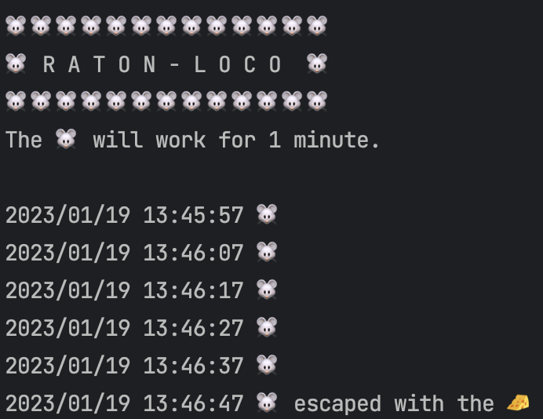

# raton-loco
🐭 Raton Loco is a Windows utility to avoid the Screesaver

## Usage

```
java -jar target/raton-loco-0.1.0-SNAPSHOT.jar UNTIL=1
```



## Other commands

```
mvn prettier:write
mvn versions:display-dependency-updates
mvn versions:display-plugin-updates
```